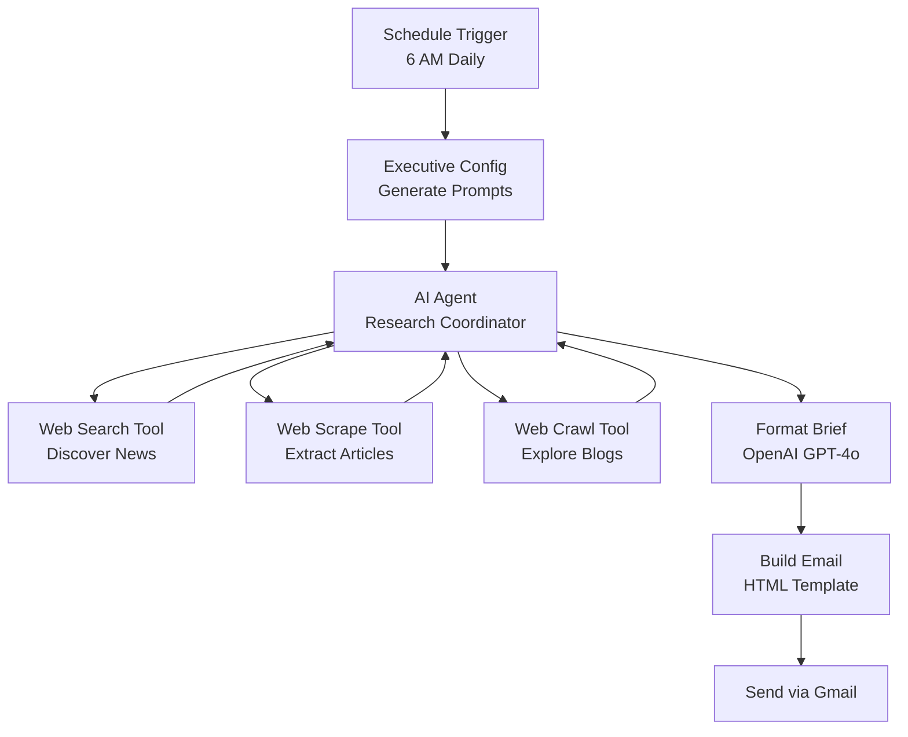

# 🎯 AI News Executive Digest - Deployment Summary

## ✅ Deployment Complete!

All workflows have been created in your n8n instance and are ready to use.

---

## 📦 Created Workflows

### 1. 🔍 AI News - Web Search Tool
- **Workflow ID:** `HQos9p9Z70mgDGSL`
- **Purpose:** Real-time AI news and developments search using Firecrawl
- **Input:** `searchPhrase` (string)
- **Output:** Structured search results with titles, URLs, descriptions
- **URL:** https://n8n-ptb2.onrender.com/workflow/HQos9p9Z70mgDGSL

**Features:**
- Optimized for AI industry news
- 10 results per search
- English language filtering
- Error handling with fallback

---

### 2. 📄 AI News - Web Scrape Tool
- **Workflow ID:** `RWo2o7HlRWOlOzWa`
- **Purpose:** Extract clean article content from specific URLs
- **Input:** `payload.url` (string)
- **Output:** Markdown and HTML formatted content
- **URL:** https://n8n-ptb2.onrender.com/workflow/RWo2o7HlRWOlOzWa

**Features:**
- Main content extraction only
- Markdown + HTML output
- 2-second render wait for dynamic content
- Clean, readable formatting

---

### 3. 🕷️ AI News - Web Crawl Tool
- **Workflow ID:** `G5f1ezKqJyumjX86`
- **Purpose:** Crawl company blogs and news sections to discover multiple articles
- **Input:** `payload.url` (string), `payload.max_pages` (number, default: 10)
- **Output:** Array of crawled pages with markdown content
- **URL:** https://n8n-ptb2.onrender.com/workflow/G5f1ezKqJyumjX86

**Features:**
- Intelligent path filtering (*/news/*, */blog/*, */announcements/*)
- Sitemap detection
- Max depth: 2 levels
- 10-second processing wait
- Optimized for: Anthropic, OpenAI, Google DeepMind blogs

---

## 🎨 Main Workflow Updated

### AI News Executive Digest - Daily Briefing
- **Workflow ID:** `6K5Nm5WpO5kmiiZ1`
- **Schedule:** Daily at 6:00 AM Central Time
- **Local File:** `financial-services-prospect-automation/workflows/ai-news-executive-digest.json`

**Updated References:**
```json
{
  "Web Search Tool": "HQos9p9Z70mgDGSL",
  "Web Scrape Tool": "RWo2o7HlRWOlOzWa",
  "Web Crawl Tool": "G5f1ezKqJyumjX86"
}
```

---

## 🚀 Next Steps - Activation Checklist

### Step 1: Activate Tool Workflows (REQUIRED)
The three tool workflows must be activated to be callable by the AI Agent:

1. **Go to n8n:** https://n8n-ptb2.onrender.com
2. **Activate each workflow:**
   - Open "AI News - Web Search Tool" → Click "Active" toggle
   - Open "AI News - Web Scrape Tool" → Click "Active" toggle
   - Open "AI News - Web Crawl Tool" → Click "Active" toggle

### Step 2: Import/Update Main Workflow
- Import the updated `ai-news-executive-digest.json` file
- OR if already imported, update the workflow IDs in the three tool nodes

### Step 3: Verify Credentials
All workflows need Firecrawl API credentials (already configured):
- **Credential Name:** "FireCrawl Deepankar"
- **Credential ID:** `kJeE16TAhpenaTQ5`

Main workflow also needs:
- **OpenRouter API** (for GPT 4o in AI Agent)
- **OpenAI API** (for Format Brief node)
- **Gmail OAuth2** (for sending email)

### Step 4: Test Before Production
1. Open the main workflow
2. Click "Execute Workflow" button (don't wait for schedule)
3. Watch the execution flow
4. Verify email arrives with proper content

### Step 5: Activate Main Workflow
Once testing is successful:
- Toggle "Active" on the main workflow
- It will run daily at 6:00 AM Central Time

---

## 🎯 How It Works



**Execution Flow:**
1. **Schedule Trigger** fires at 6 AM Central
2. **Code Node** generates research prompts with today's date
3. **AI Agent** executes research using all three tools:
   - Searches for breaking AI news
   - Scrapes key articles from search results
   - Crawls Anthropic, OpenAI, Google blogs
4. **OpenAI** formats raw research into structured JSON
5. **Code Node** builds beautiful HTML email
6. **Gmail** sends to recipient

---

## 🔧 Customization Options

### Change Email Recipient
Edit the `Code - Build Email` node:
```javascript
recipient:'parker@syntora.io'  // Change this email
```

### Modify Schedule
Edit the `Schedule Trigger` node:
```json
"expression": "0 6 * * *"  // Change time (cron format)
"timezone": "America/Chicago"  // Change timezone
```

### Adjust Research Focus
Edit the `Code - Executive Config` node to modify:
- Search queries
- Priority sources
- Research categories
- Output format requirements

### Tool Limits
Modify in each tool workflow:
- **Search:** Results limit (currently 10)
- **Scrape:** Wait time (currently 2 seconds)
- **Crawl:** Max pages (currently 10), max depth (currently 2)

---

## 📊 Expected Performance

### Research Coverage
- **5-10 searches** across different AI topics
- **3-5 article scrapes** for deep dives
- **1-3 blog crawls** (Anthropic, OpenAI, Google)

### Execution Time
- **Web Search:** ~2-3 seconds per search
- **Web Scrape:** ~3-5 seconds per article
- **Web Crawl:** ~15-20 seconds per blog (includes wait time)
- **Total Workflow:** ~3-5 minutes (depends on AI agent iterations)

### Cost Estimate (per execution)
- **Firecrawl API:** $0.10-0.30 (searches + scrapes + crawls)
- **OpenRouter (GPT 4o):** $0.50-1.00 (agent reasoning)
- **OpenAI (GPT 4o):** $0.10-0.20 (formatting)
- **Total:** ~$0.70-1.50 per daily brief

---

## 🛠️ Troubleshooting

### "Workflow does not exist" Error
**Cause:** Tool workflows not activated or IDs incorrect
**Solution:** 
1. Check all three tool workflows are active
2. Verify workflow IDs match in main workflow

### No Content in Email
**Cause:** AI Agent not finding relevant news
**Solution:**
1. Check Firecrawl API credentials
2. Verify search queries in Executive Config
3. Test individual tool workflows

### Email Not Sending
**Cause:** Gmail credentials or quota issues
**Solution:**
1. Re-authenticate Gmail OAuth2
2. Check Gmail sending limits (500/day free tier)
3. Verify recipient email in Code node

### "Rate Limit" Errors
**Cause:** Too many API calls too quickly
**Solution:**
1. Reduce max_pages in crawl tool
2. Adjust AI agent max iterations (currently 30)
3. Add delays between tool calls

---

## 📚 Related Documentation

- **Firecrawl API Docs:** https://docs.firecrawl.dev
- **n8n AI Agent Docs:** https://docs.n8n.io/integrations/builtin/cluster-nodes/root-nodes/n8n-nodes-langchain.agent/
- **OpenRouter Docs:** https://openrouter.ai/docs
- **Gmail n8n Docs:** https://docs.n8n.io/integrations/builtin/app-nodes/n8n-nodes-base.gmail/

---

## 🎉 What's Different from Generic Tools?

These workflows are specifically optimized for AI news research:

### Web Search Tool
- ✅ 10 results vs generic 5
- ✅ English language filter
- ✅ Better error messaging for news context

### Web Scrape Tool  
- ✅ Main content only (removes navigation/ads)
- ✅ 2-second render wait for dynamic content
- ✅ Dual format output (markdown + HTML)

### Web Crawl Tool
- ✅ Smart path filtering (`**/news/**`, `**/blog/**`)
- ✅ Optimized depth (2 levels)
- ✅ Lower page limits for faster execution
- ✅ Markdown-only output (cleaner for AI processing)

---

## 📈 Success Metrics

After 7 days of operation, evaluate:
- ✅ Email delivery success rate (target: 100%)
- ✅ Content quality and relevance (target: 80%+ actionable)
- ✅ Execution time consistency (target: <5 minutes)
- ✅ Cost per execution (target: <$1.50)
- ✅ Zero duplicate stories in same category

---

## 🎯 Support & Iteration

### Phase 1 (Days 1-7): Monitoring
- Check daily briefs for quality
- Note any missing important news
- Track execution times and costs

### Phase 2 (Week 2+): Optimization
- Refine search queries based on gaps
- Adjust priority sources
- Tune AI agent prompts
- Add/remove research categories

### Phase 3 (Month 2+): Enhancement
- Add more source integrations (Reddit, Twitter/X)
- Implement sentiment analysis
- Add competitive intelligence tracking
- Create weekly digest format

---

**Deployment Date:** November 5, 2025  
**Version:** 1.0  
**Status:** ✅ Ready for Activation  
**Next Action:** Activate the 3 tool workflows in n8n UI

